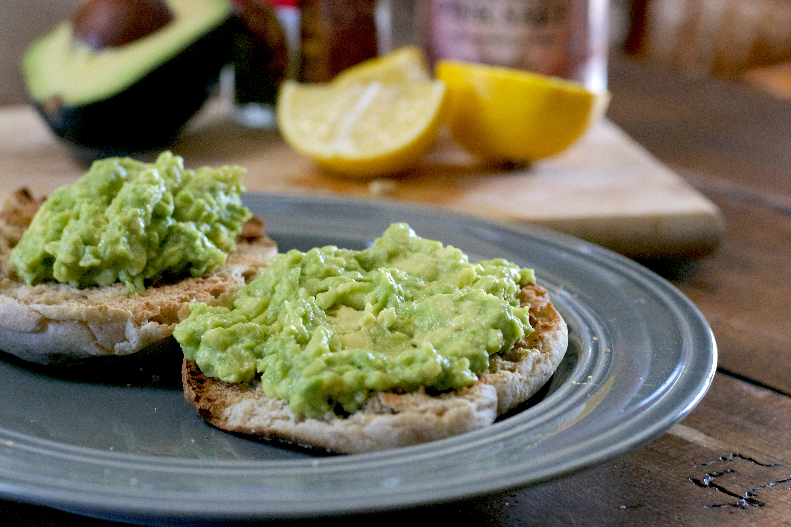

# How to make Avocado Toast

This task includes instructions on how to make avocado toast for
yourself.

## Tools

- 1 Avocado
- Salt
- Pepper
- Unsalted butter
- Fork
- Shallow bow
- Toaster
- Garlic
- Knife

## Steps

1. Soften the butter by leaving it out for about 15 minutes
2. Peel the garlic and cut it in half
3. Mash the avocado with your fork in the small bowl until it is chunky
4. Season the avocado with salt and pepper
5. Toast the bread until it is browned and crisp
6. Rub garlic and butter onto one side of your toast
7. Rub the avocado onto the same side of the toast  
    It should look like Figure 1

**Figure 1:**  


