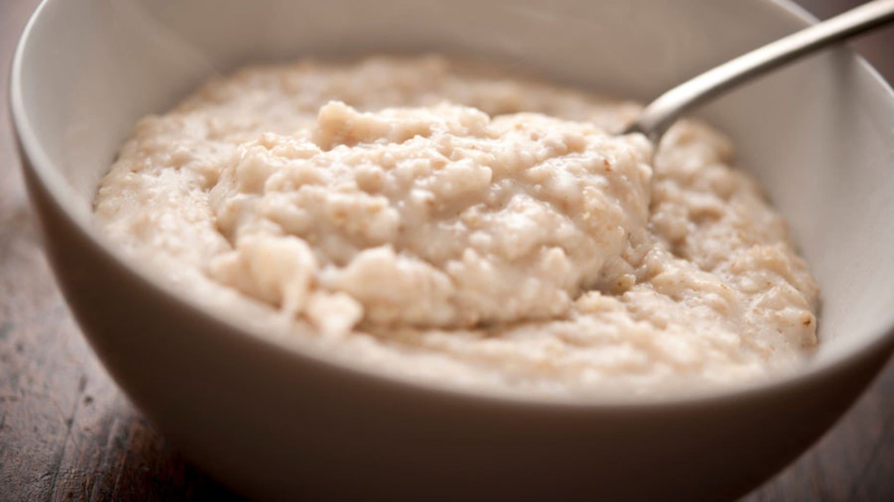

# How to make Oatmeal

This task includes instructions for making oatmeal for breakfast

## Tools

- Milk
- Oats
- Microwave
- Bowl
- Brown Sugar

## Steps

1. Add 1/2 cup of oats to your bowl
2. Add 1 cup of milk into your bowl of oats
3. Stir until the milk is evenly distributed throughout the oats
4. Microwave the oatmeal for about 1 minute and 45 seconds
5. Add brown sugar to your oatmeal
6. Stir until the brown sugar is fully mixed into the oatmeal  
    It should look like Figure 4

**Figure 4:**  


