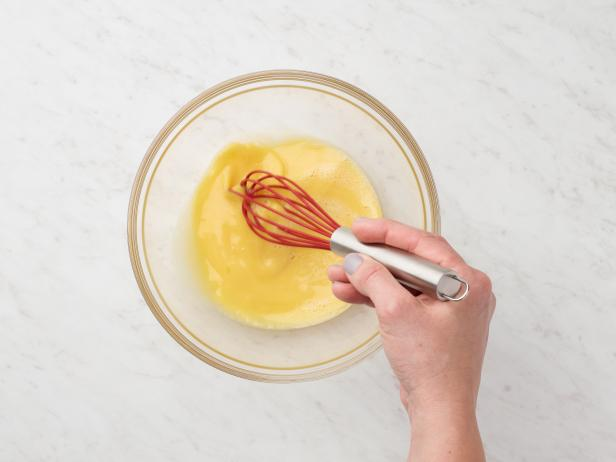

# How to make an Omelet

This task includes instructions on how to make an omelet for yourself.

## Tools

- Balloon whisk
- Nonstick skillet
- Rubber spatula
- Medium bowl
- 2 large eggs
- Milk
- Butter
- Salt

## Steps

1. Preheat your skillet over medium heat
2. Pour 2 tablespoons of milk, 2 eggs, and a pinch of salt into your bowl
3. Stir this mixture until it looks like figure 3
4. Disperse butter over your skillet
   1. Put 1 tablespoon of butter on the skillet
   2. Gently swirl the skillet to evenly distribute the as it melts
5. Turn off the heat under your skillet and wait until the butter stops bubbling
6. Pour your egg mixture onto the skillet and vigorously stir
7. Allow the mixture time to set
8. (Optional) Add any topping you would like, such as hot sauce or herbs

**Figure 3:**  


