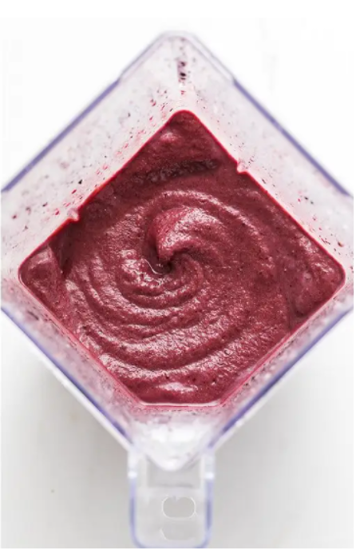

# How to make and Acai Smoothie

This task includes instructions on how to make an acai smoothie for
breakfast.

## Tools

- Unsweetened acai powder
- Frozen berry mix
- Frozen banana
- Almond milk
- Blender

## Steps

1. Pour the acai powder, berry mix, banana, and almond milk into a
    blender

    *Note:* In the future you can change this to however you prefer but I
    would recommend a 1:1 ratio of banana to berries
2. Run the blender until the mixture resembles a thick liquid (like
    figure 2)

    *Note:* If the blender seems to be struggling, add more almond milk to the
    mixture
3. Pour the smoothie into a glass

**Figure 2**  


